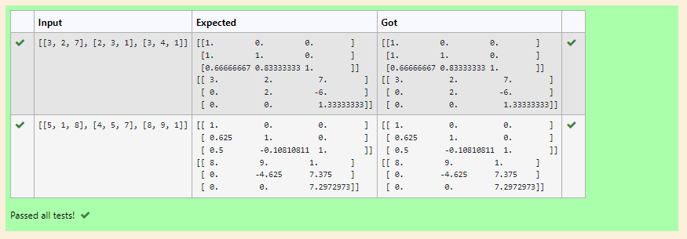
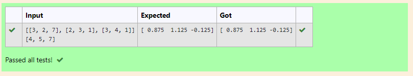

# LU Decomposition without zero on the diagonal
a)
## AIM:
To write a program to find the L and U matrix using LU Decomposition.

## Equipments Required:
1. Hardware – PCs
2. Anaconda – Python 3.7 Installation / Moodle-Code Runner

## Algorithm
1. Import numpy as the first step
2. from scipy.linalg import lu
3. Get the values of the matrix from the user using eval function
4. print the values

## Program:
```
/*
Program to find the L and U matrix using LU Decomposition.
Developed by: Shavedha
RegisterNumber: 21500429
*/
import numpy as np
from scipy.linalg import lu
A = np.array(eval(input()))
P, L, U = lu(A)
print(L)
print(U)
```

## Output:



## Result:
Thus the program to find the  L and  U matrix using LU Decomposition  is written and verified using python programming.

b)
## AIM:
To write a program to solve the matrix using LU Decomposition.

## Equipments Required:
1. Hardware – PCs
2. Anaconda – Python 3.7 Installation / Moodle-Code Runner

## Algorithm
1. Import numpy as the first step
2. from scipy.linalg import lu_factor and lu_solve
3. Get the values of the matrix from the user using eval function
4. print the values 

## Program:
```
/*
Program to solve the matrixusing LU Decomposition.
Developed by: Shavedha
RegisterNumber: 21500429
*/
import numpy as np
from scipy.linalg import lu_factor and lu_solve
a=np.array(eval(input()))
b=np.array(eval(input()))
lu_pivot=lu_factor(a)
x=lu_solve((lu_pivot),b)
print(x)
```

## Output:



## Result:
Thus the program to solve the matrix using LU Decomposition is written and verified using python programming.
